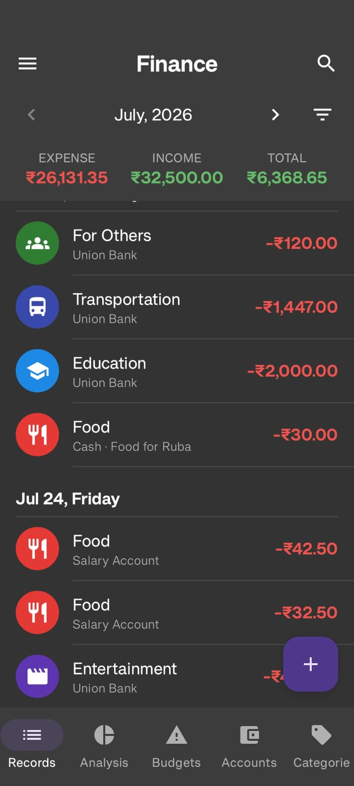
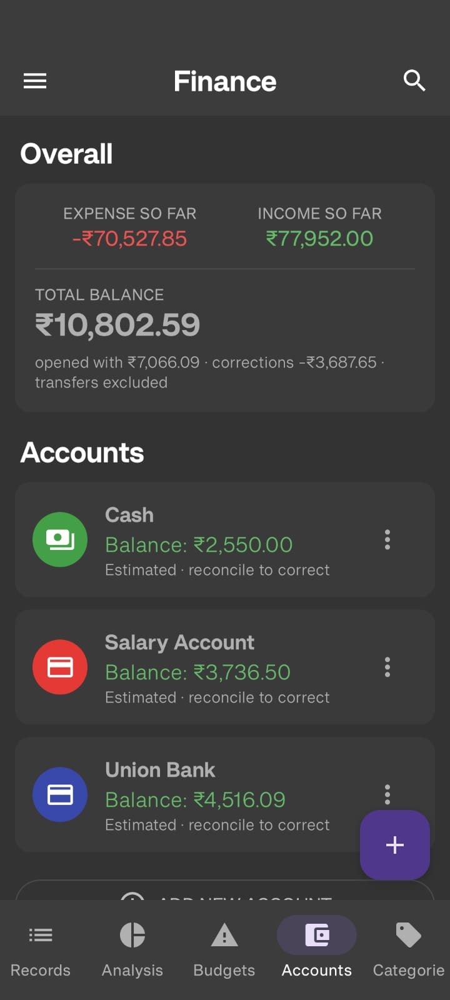
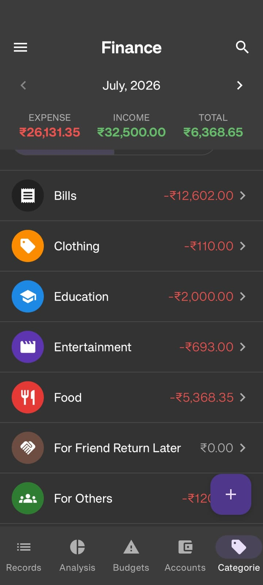
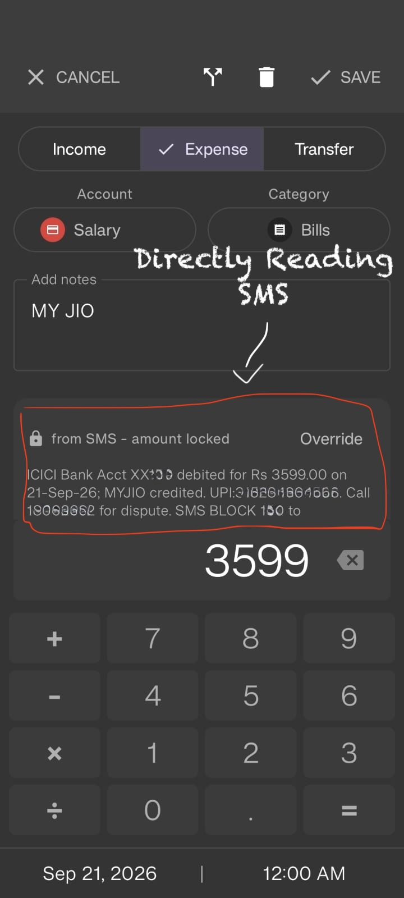
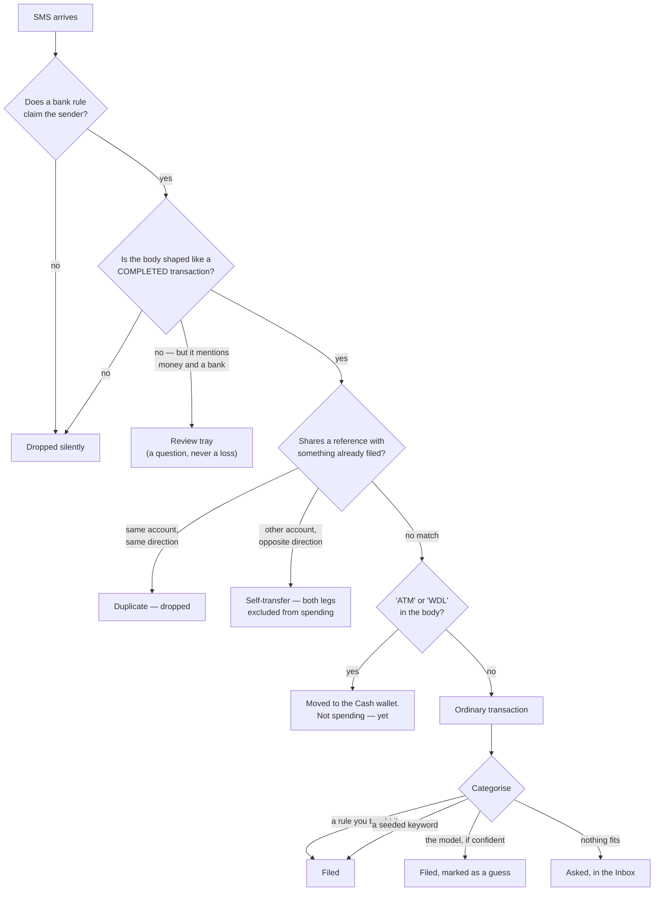
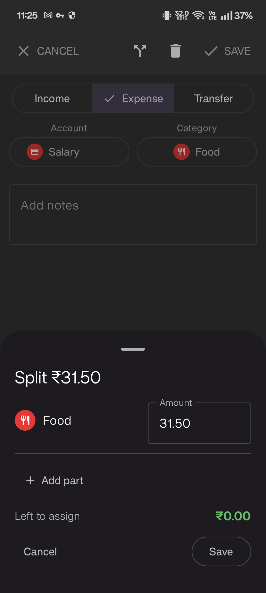
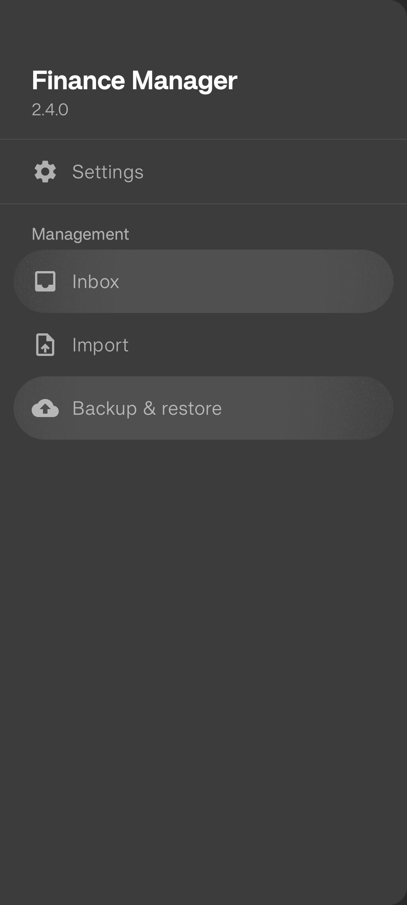

<div align="center">

# Finance Manager

**Your bank already texts you every time money moves.
This app just listens.**

[](#)
[](#)
[](#)
[](#)
[](#verification)
[](#no-network-and-the-build-proves-it)





</div>

---

## The idea

Every Indian bank sends an SMS the instant money leaves or enters your account. That
message contains the amount, the date, the payee, a reference number, and often the
balance. It is a complete, real-time, authoritative transaction feed, and it is already
sitting on your phone.

Most finance apps ignore it. They ask you to type each payment in by hand, or they ask
for your net-banking credentials so a server somewhere can fetch statements on your
behalf. The first is a habit almost nobody keeps for more than three weeks. The second
means handing your bank login to a third party.

This app reads the messages you were already getting. No account, no server, no login,
no network permission at all. Payments appear in the ledger because the bank announced
them, not because you remembered to write them down.

<div align="center">

</div>

When you open a payment the app captured, the bank's own message is still there
underneath it — and the amount is **locked**. You can change the category, the note and
the date freely, because those are the app's guesses. The amount and the direction are
the bank's facts, and overriding one takes a deliberate second tap.

---

## The rule everything else follows

> **A personal finance app that is quietly wrong once is a personal finance app you
> stop believing.**

Almost every decision in this codebase falls out of that. The app is allowed to not
know things. It is not allowed to make something up and present it as fact.

In practice that means:

- **It asks rather than guesses.** A payment it cannot categorise goes into a queue as
  a question, not into `Uncategorised` where you would never look at it again.
- **Every guess is marked as a guess** — in the ledger, in the pickers, and in the
  notification. Guessed rows can be filtered and reviewed as a group.
- **Corrections are visible rows.** Reconciling a drifted balance writes an
  `ADJUSTMENT` transaction you can look at, rather than silently editing the number.
- **Nothing rounds behind your back.** Money is `Long` paise end to end; `Double` never
  touches it.
- **A failure is louder than a silent loss.** There is deliberately no
  `fallbackToDestructiveMigration` — a missing migration crashes the app, because
  wiping a ledger is worse than a crash.

---

## How a bank message becomes a ledger row



---

## Design decisions

### Structure, not keywords, decides what is a transaction

A message becomes a transaction only by matching a bank format **structurally** — an
allowlist, not a blocklist. Fraud warnings, promos, mandates and OTPs are rejected
without a single banned word, because none of them are *shaped* like a completed
payment.

This matters more than it sounds. Real Union Bank debits end with
`Never Share OTP/PIN/CVV`, so blocklisting "OTP" would reject every genuine Union
transaction the app ever sees.

The direction is bound to the account token, never to a keyword:

```
"Acct XX742 debited for Rs 169.00 on 11-Sep-26; SRI LAKSHMI TRA credited."
```

Every ICICI *debit* contains the word "credited" — the **payee** is credited. Keying on
keywords would file every rupee you spend as income.

### The same amount and the same reference can mean three different things

```
ICICI  Acct XX742 debited  Rs 3000.00  16-Sep-26  A K SHARMA
Union  A/c *8317 Credited  Rs 3000.00  16-09-2026  Mob Bk        ← same ref no
```

A naive "same reference means duplicate" rule deletes one of these. The Union balance
never rises while the ICICI balance falls, and ₹3,000 moved between your own accounts
books as spending. The discriminator is direction *and* account:

| | Same direction | Opposite direction |
|---|---|---|
| **Same account** | Duplicate — the bank alerted twice | — |
| **Other account** | — | Two legs of one transfer |

ATM withdrawals get the same treatment for the same reason: cash out of a machine is
money changing pocket, not money spent. The debit is paired with a credit into a Cash
wallet, and neither counts as spending. What you actually spent is the cash entries you
log afterwards.

### Three tiers of categorisation, weakest last

| Tier | What it is | Wins because | Marked as a guess? |
|---|---|---|---|
| **1. Learned rule** | A correction you made once | It is your own past decision | No |
| **2. Seed keyword** | `SWIGGY → Food`, whole-word, longest-first | Deterministic and auditable — same payee, same answer, forever | No |
| **3. Naive Bayes** | Resemblance to what you have already filed | Only fires where the app would otherwise give up | **Yes** |

The ordering is the whole safety argument for putting a classifier anywhere near a
ledger: **the model sits last, so turning it on cannot change any outcome that is
already correct.** It only ever answers where the alternative was a shrug.

A few things about the model that were deliberate:

- **Bernoulli, not multinomial.** The multinomial form divides by how many features an
  example carried, so categories whose payees have short names score higher on
  *everything* — including rows with no payee at all. That would decide Union
  transactions on the length of other people's shop names.
- **It reads amount, hour, weekday, account and channel — not just text.** Union sends
  no payee at all, which is roughly a quarter of spending. ₹120 at half one on a
  Tuesday is not nothing.
- **It never trains on its own guesses.** A model that reads its own output back
  reinforces its own mistakes until they cannot be shifted.
- **Nothing is persisted.** It is rebuilt from the ledger at launch, so a bug in the
  incremental path is wrong until the next start, and a restored backup is correct for
  free.
- **It refuses to file unless it is well ahead of the runner-up.** Naive Bayes reports
  badly calibrated probabilities — it will happily say 0.99 about very little — so the
  gate reads the *gap* between the top two, not the number on the top one.

And because every guess is marked, the app knows how often it was right without ever
asking you: the moment you touch a guessed row, it learns whether it had been correct.

### One debit is often several facts

<div align="center">

</div>

`Rs 320.00 debited ... KA 05 JUICE BAR` can be two things at once: ₹200 you ate, and
₹120 you fronted for a friend. Forcing one category on the whole ₹320 overstates Food
by 120 every time, or understates it by 200 — and hand-compensating for that month
after month is what makes the same shop flip categories.

Split parts are ordinary transactions sharing a `splitGroupId`, so the ledger, the
donut, budgets, search and the CSV export needed **no changes at all** to understand
them. Two categories behave specially:

- **For Others** — ordinary spending that happened to be for someone else. Counts
  everywhere Food does.
- **For Friend Return Later** — money you are *holding*, not spending. Written with
  `countsAsSpending = false`, so it leaves your expense figure and your budgets without
  either needing to learn a new concept.

The keypad above it is a calculator, and every key runs through `BigDecimal`: `700/3`
books 233.33 and *says* it rounded, rather than quietly inventing a fraction of a paisa.

### One bank tells you the balance. The other doesn't.

Union sends `Avl Bal` with every message — the bank's own truth, which always wins.
That account is self-healing: one missed SMS and the next one puts it right.

ICICI sends nothing. Its balance can only be computed by arithmetic, so it drifts with
every message the phone never received. The app doesn't pretend otherwise — the
Accounts screen labels those balances *Estimated · reconcile to correct*, and the
correction you type becomes a visible `ADJUSTMENT` row rather than a silent edit.

### An import you can rehearse

Importing years of history out of another app happens **once** and cannot be practised
afterwards — so it has to be practisable *before*, on the real file, with no way to do
harm. Everything above the import button writes nothing, so a file can be checked as
often as you like.

The report leads with a conservation figure — `226 rows = 226 understood + 0 rejected`
— because if those ever fail to add up, the file was read wrongly and nothing else in
the report is reliable. Before it will write anything the importer **refuses** rather
than warns: row counts must add up, and every account name in the file must be bound to
an account here. Merging never overwrites — the file may only fill fields the bank never
supplied. Every row lands in exactly one of `IMPORTED / MERGED / QUEUED / SKIPPED /
REJECTED`, and all of them are counted.

→ Full mechanics in **[docs/DESIGN-NOTES.md](docs/DESIGN-NOTES.md)**.

### No network, and the build proves it

The app holds two permissions: `RECEIVE_SMS` and `POST_NOTIFICATIONS`. It does **not**
hold `INTERNET`, and that is enforced rather than promised:

```kotlin
// app/build.gradle.kts — fails the build if the merged manifest grants INTERNET
if (manifest.readText().contains("android.permission.INTERNET")) {
    throw GradleException(
        "This app's privacy claim is that bank data cannot leave the device, and " +
        "that claim is only worth anything while it is verifiable."
    )
}
```

Manifest merging pulls in permissions declared by libraries, so a dependency added two
years from now could hand this app network access without anyone deciding to.
`tools:node="remove"` strips it whatever asks for it, and the Gradle task reads the
manifest the APK is *actually built from* — because a directive nobody checks is just a
comment.

"Your bank messages cannot leave this phone" is checkable by anyone with `aapt`. That is
a very different claim from one you have to take on trust.

Note also that it asks for `RECEIVE_SMS` only, **not** `READ_SMS`: there is no inbox
backfill, so the app can see messages that arrive from now on and has no access to the
ones already on your phone.

---

## The home screen widget

```
┌────────────────────────────────────────┐
│  September                             │
│  ₹18,240 of ₹42,000 in          ┌───┐  │
│  █████████░░░░░░░░░░░░  43%     │ + │  │
│  ₹23,760 left · 8 days          └───┘  │
└────────────────────────────────────────┘
```

One 4×2 widget, plain `RemoteViews`, no new dependency. It counts the **salary cycle**
— payday to payday — which is the one place in the app that does not count calendar
months. That is deliberate and it has a cost: the Budgets screen's September and the
widget's September cover different days and will not match. The widget answers "how
much of this pay packet is left", which is a different question from "what did
September cost".

The bar needs a ceiling, and takes the first of these that exists:

1. The overall budget for the month the cycle is labelled with
2. **Income received this cycle** — reads "of ₹42,000 **in**". Because a cycle opens
   on salary day, this is your salary from hour one
3. Neither — no bar, and it says "waiting for salary" rather than drawing an empty
   trough, which would read as "you have spent nothing"

Tapping it opens Budgets; the `+` opens a new expense. It never polls: every figure it
shows is moved by an SMS arriving, by something you did in the app, or by the date
changing, and each of those pushes a redraw. Figures are whole rupees — the only place
in the app that drops paise, because at arm's length the bar needs the width more.

---

## Getting around

<div align="center">

</div>

Five tabs for the ledger, and a drawer for everything you do occasionally:

| Tab | |
|---|---|
| **Records** | The ledger, grouped by day. Rows lead with the category; the subtitle carries the account *and* the payee, because the payee is the only thing distinguishing two ₹320 Food rows. |
| **Analysis** | Where the period's money went, as a ring and a ranked list. Drawn with `Canvas` rather than a charting library — one arc per slice is a dozen lines, and the colours have to match the category discs exactly. |
| **Budgets** | Limits on the salary cycle, not the calendar month. Every card says which cycle it means, because a limit that is standing and one pinned to this cycle look identical otherwise. |
| **Accounts** | Balances, and the Overall card. Expense and income stay *pure* — opening balances and corrections are reported separately instead of being folded into income, which would inflate every income figure with money that was never earned. |
| **Categories** | The vocabulary, and what each one cost this period. |

**Inbox** is the drawer item that matters most: everything the app could not decide on
its own, in one queue — a new account seen in a message, a balance to confirm, payments
needing a category, and messages the parser could not read. Each item is a question with
an answer, and once answered it leaves.

---

## Architecture

```
parser/    Bank formats as structural rules. Pure Kotlin.
             BankRules.kt      ICICI + Union. Start here to add a bank.
             Detectors.kt      Channel detection, future/promo rejection.

domain/    All the logic, and no Android imports, so it runs on the JVM.
             SmsIngestor.kt    parse → classify → persist → balances
             TransferResolver  Duplicate vs self-transfer vs ATM
             Ledger.kt         The one definition of "expense" every screen reads
             Categorizer.kt    The three tiers, and which one wins
             CategoryModel.kt  Naive Bayes, and the gate it has to clear
             Splitter.kt       One debit → several facts. Pure; no balance touched.
             Calculator.kt     BigDecimal keypad arithmetic
             CycleCalculator   Salary anchor + last-working-day fallback

importer/  Seven stages, the first six of which write nothing.
             Dialect → ColumnMap → ValueParsers → CsvImporter
             DiffMatcher (the capture figure) → Committer (pure) → ImportService

data/      Room. Schema v5, migrations, pre-migration snapshots.
backup/    Database backup, validated restore, CSV export.
ui/        Compose + Material 3.
```

The split that does the work is **`domain/` has no Android in it**. Transfer
resolution, the classifier, split arithmetic, ledger totals, cycle maths and the whole
importer are plain Kotlin — which is why the full suite of 343 tests executes in a
quarter of a second, with no emulator anywhere.

Two things are deliberately *pure* even though it would have been easier not to:
`Splitter.plan()` decides what a split would write without writing it, and the
importer's `Committer` decides what a commit would do without doing it. The arithmetic
that must never be wrong is the part worth testing, and it is testable without a
database in the way.

---

## Verification

**343 tests across 43 classes. 0 failures, 0 skipped.**

```bash
export JAVA_HOME=/opt/homebrew/opt/openjdk@21
export ANDROID_HOME=$HOME/Library/Android/sdk
gradle :app:testDebugUnitTest
```

Every ICICI and Union assertion runs against **real messages from the phone**, and the
importer is tested against the real 226-row export rather than a file written to suit
it. `RealExportTest` fails rather than skips when that fixture is missing — a test that
passes by not running reports success for work it never did.

Honest about what is *not* proven: the ICICI ATM message *layout* is a guess, since no
real withdrawal has arrived yet. Channel detection keys on `ATM`/`WDL` appearing
anywhere in the body, which is far more stable than any sentence layout — and if the
first real withdrawal doesn't match, it lands in the review tray rather than being lost.
Card/POS formats have no rules written at all.

→ Full status, known limits, schema and migration notes in
**[docs/DESIGN-NOTES.md](docs/DESIGN-NOTES.md)**.

---

## Build

```bash
export JAVA_HOME=/opt/homebrew/opt/openjdk@21
export ANDROID_HOME=$HOME/Library/Android/sdk
gradle :app:assembleDebug
```

Then `adb install -r app/build/outputs/apk/debug/app-debug.apk`, or copy the APK across
and open it.

On first launch, grant **SMS** and **Notifications**, then add each account with its
current balance under Settings. No digits or bank codes — the app attaches messages to
accounts itself, and auto-creates one for any sender it doesn't recognise.

> If the SMS toggle is greyed out, Android is blocking it because the app was installed
> outside the Play Store. App info → ⋮ → **Allow restricted settings**, then open
> Permissions.

**Stack:** Kotlin 2.0.21 · Jetpack Compose (BOM 2024.10.01) · Material 3 · Room 2.6.1
via KSP · minSdk 26 · targetSdk 35. No other runtime dependencies.

---

<div align="center">
<sub>Built for one phone, two banks and one person's actual money.</sub>
</div>
